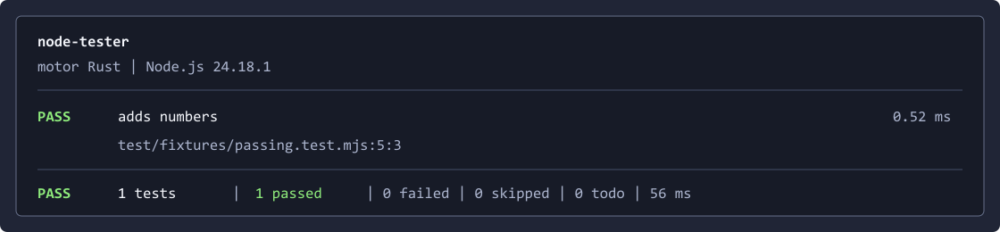

<h1 align="center">Node Tester</h1>

<p align="center">
  CLI TypeScript para ejecutar <code>node:test</code> mediante un motor de control escrito en Rust.
</p>

<p align="center">
  <a href="https://github.com/Roger08G/node-tester/actions/workflows/ci.yml"></a>
  <a href="https://github.com/Roger08G/node-tester/releases"></a>
  <a href="https://github.com/Roger08G/node-tester/stargazers"></a>
  <a href="https://github.com/Roger08G/node-tester/network/members"></a>
  
  
  <a href="LICENSE"></a>
</p>

`node-tester` ejecuta tests del runner nativo `node:test`, delega el control de
procesos a una biblioteca Rust y presenta el resultado desde una CLI TypeScript.

Ejecutar los tests:

```console
node-tester test/unit.test.mjs
```



## Arquitectura

```text
CLI TypeScript
    │ Node-API
    ▼
Biblioteca node-tester-engine (Rust)
    │ proceso controlado + protocolo JSON v1
    ▼
Bridge Node.js → node:test → procesos aislados por archivo
```

Rust controla el proceso completo: validación, lanzamiento, timeout global, cancelación, terminación del árbol de procesos, límites de memoria para la salida y agregación de eventos. TypeScript se limita al contrato de la CLI y al formato visual. Node.js continúa ejecutando el código JavaScript, preservando la semántica oficial de `node:test`.

La herramienta no analiza TAP ni el texto de los reporters incorporados. Consume los eventos estructurados de `TestsStream` mediante un bridge versionado.

## Compatibilidad de la versión 1.0

- Node.js 22.13 o posterior.
- ESM y CommonJS.
- Windows x64 y ARM64.
- Linux GNU x64 y ARM64.
- macOS Intel y Apple Silicon.
- Runner nativo `node:test` con aislamiento por proceso de archivo.

Jest, Vitest, Mocha, Bun Test, harnesses personalizados, modo watch y cobertura no forman parte del contrato 1.0. Se implementarán como adaptadores independientes si se incorporan posteriormente.

## Instalación

El nombre npm sin scope `node-tester` pertenece a otro proyecto. Esta distribución está preparada como paquete público con scope:

```bash
npm install --global @rogergomezm/node-tester
node-tester --version
```

El paquete instala el comando `node-tester` globalmente. También puede usarse
como biblioteca ESM desde `@rogergomezm/node-tester`.

## Uso

```text
node-tester [rutas...] [opciones] [-- argumentos-del-test]
```

Ejemplos:

```bash
node-tester test/unit.test.mjs
node-tester --glob "test/**/*.test.mjs" --concurrency 4
node-tester test/api.test.mjs --name "creates a user" --test-timeout 10s
node-tester test/typescript.test.ts --node-arg --experimental-strip-types
```

| Opción                    | Función                                               |
| ------------------------- | ----------------------------------------------------- |
| `--glob <patrón>`         | Selecciona archivos con un glob; se puede repetir.    |
| `--name <regex>`          | Incluye tests por nombre.                             |
| `--skip <regex>`          | Excluye tests por nombre.                             |
| `--only`                  | Ejecuta tests marcados con `only`.                    |
| `--concurrency <n>`       | Limita los archivos ejecutados en paralelo.           |
| `--test-timeout <tiempo>` | Timeout por test; admite `ms`, `s` y `m`.             |
| `--run-timeout <tiempo>`  | Timeout global aplicado por Rust.                     |
| `--max-output-kb <n>`     | Limita la captura conjunta de salida.                 |
| `--show-output`           | Muestra la salida capturada; está oculta por defecto. |
| `--node <ruta>`           | Selecciona el ejecutable Node.js.                     |
| `--node-arg <argumento>`  | Añade un argumento a los procesos Node de test.       |

Códigos de salida:

| Código | Significado                                     |
| ------ | ----------------------------------------------- |
| `0`    | Todos los tests han pasado.                     |
| `1`    | Existen fallos.                                 |
| `2`    | Uso inválido, incompatibilidad o error interno. |
| `124`  | Timeout global.                                 |
| `130`  | Cancelación mediante señal.                     |

## Límites y seguridad

- Timeout por test predeterminado: 30 segundos.
- Timeout global predeterminado: 15 minutos.
- Captura total predeterminada: 64 KiB; máximo configurable por el motor: 64 MiB.
- Cada mensaje del protocolo y el número total de eventos tienen límites defensivos.
- Las rutas del proyecto y del directorio personal se eliminan de las trazas mostradas.
- El bridge y el binario nativo se cargan desde rutas fijas del paquete.
- La primera señal cancela y limpia los procesos; una segunda señal fuerza la salida.

`node-tester` ejecuta código de test con los permisos del usuario. No es un sandbox para código no confiable. `--node-arg` puede cargar módulos y debe tratarse como ejecución de código local.

## Desarrollo

Requisitos:

- Node.js 24 para desarrollar y Node.js 22.13 para la prueba de compatibilidad mínima.
- Bun 1.3.14.
- Rust 1.98.0 con `rustfmt` y `clippy`.
- Toolchain nativo del sistema: MSVC, Clang/Xcode o GCC.

```bash
bun install --frozen-lockfile
bun run format:check
bun run build
bun run check:rust
bun run typecheck
bun run test
```

La biblioteca Rust está en `rust/engine`; `rust/node-addon` contiene únicamente el binding Node-API.

## Rendimiento

El repositorio incluye un benchmark reproducible frente a `node --test`:

```bash
bun run benchmark -- 10
```

El benchmark informa la mediana y la sobrecarga observada. El proyecto no afirma ser más rápido que Node sin evidencia publicada para cada plataforma.

## Release

La CI compila y prueba seis binarios nativos con Node.js 22.13.0 y 24. Un tag `v<versión>` solo publica después de superar Rust, TypeScript, auditorías, pruebas por plataforma, ensamblado del paquete y verificación de checksums. La publicación utiliza procedencia npm y genera un release de GitHub con el paquete y su SHA-256. El flujo es reintentable si npm o GitHub completan solo una parte del release.

La publicación de producción utiliza el environment protegido `npm` y Trusted
Publishing mediante OIDC, sin credenciales persistentes en el repositorio.

Consulta [CONTRIBUTING.md](CONTRIBUTING.md), [SECURITY.md](SECURITY.md) y [CHANGELOG.md](CHANGELOG.md).

## Licencia

MIT. Consulta [LICENSE](LICENSE).
